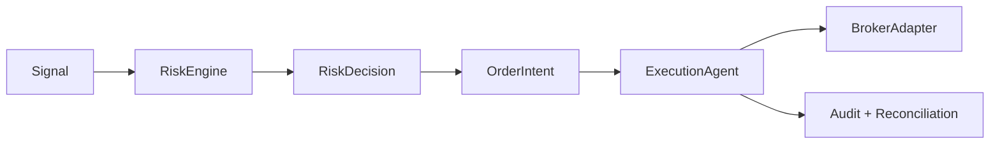

# Architecture

Sandy-Trading-AI is built around a deterministic safety kernel.

LLM output is not trusted for execution. Any future LLM agent may produce candidate analysis only. RiskEngine and ExecutionAgent own capital-protective decisions.

The first implementation includes:

- SQLAlchemy models for auditability and state.
- Pydantic contracts for boundary validation.
- Broker skeletons for Zerodha and Alpaca using real APIs.
- Provider skeletons for Zerodha, Alpaca, Alpha Vantage, Finnhub, Yahoo research, and FX.
- FastAPI status/control endpoints.
- No order placement endpoint.
